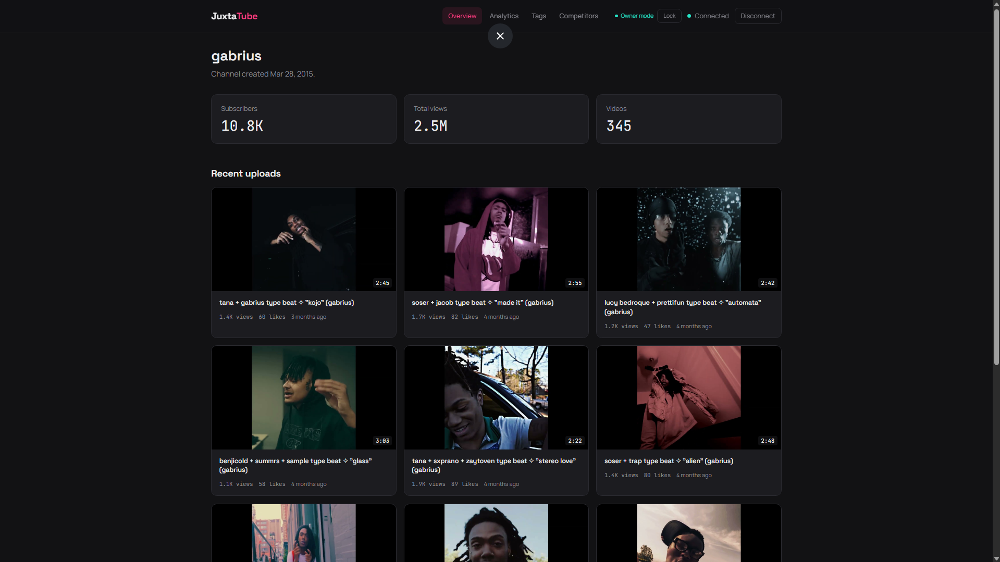
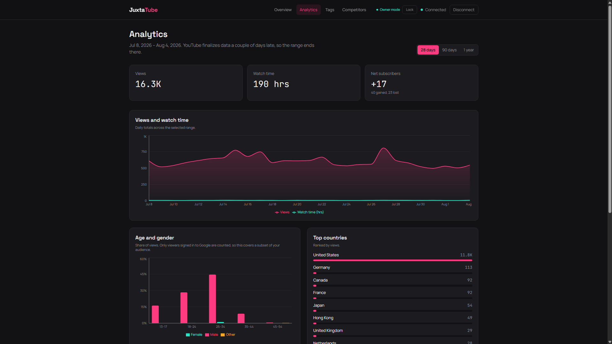
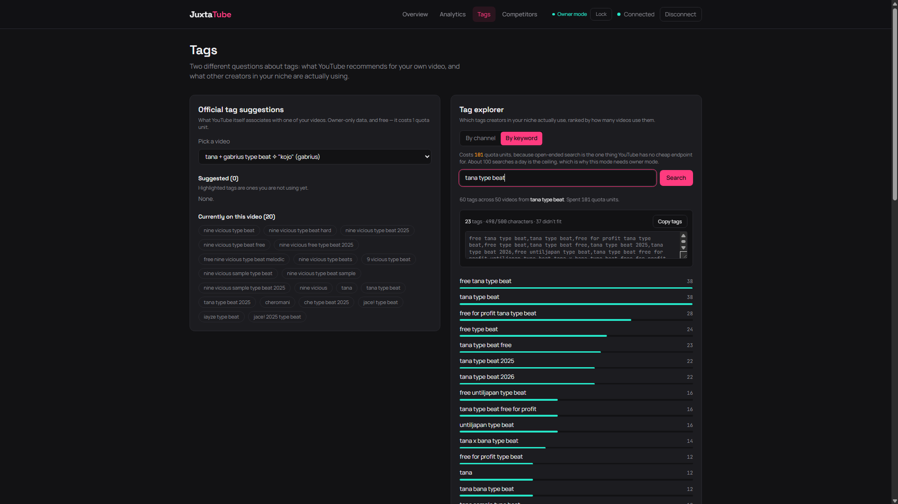
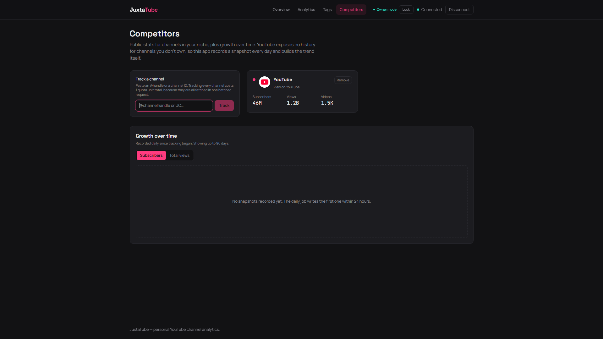

<div align="center">

# JuxtaTube

### Your YouTube channel's numbers, all on one screen.

See how your channel is growing, who's actually watching, which tags to use on your
next upload, and whether the channels you compete with are pulling ahead.

<a href="https://juxtatube.vercel.app"><strong>View the live dashboard</strong></a>
&nbsp;·&nbsp;
<a href="#set-it-up-for-your-own-channel"><strong>Set it up yourself</strong></a>
&nbsp;·&nbsp;
<a href="docs/ARCHITECTURE.md"><strong>How it's built</strong></a>

<br />


<br />
<br />



<p><sub>Overview — live public stats and recent uploads</sub></p>

<table>
  <tr>
    <td width="50%">
      
      <p align="center"><sub>Analytics</sub></p>
    </td>
    <td width="50%">
      
      <p align="center"><sub>Tags</sub></p>
    </td>
  </tr>
  <tr>
    <td colspan="2" align="center">
      
      <p><sub>Competitors</sub></p>
    </td>
  </tr>
</table>

</div>

<br />

## What's inside

| | What it shows you |
| :-- | :-- |
| **Overview** | Subscribers, total views, and your recent uploads with views and likes on each one. |
| **Analytics** | Watch time, how many subscribers you gained and lost, the age and gender of your viewers, which countries they're in, and how they found your videos. |
| **Tags** | The tags YouTube itself recommends for one of your videos, plus the tags that other channels in your niche are actually using — ranked, and ready to copy and paste. |
| **Competitors** | Track any channels you want and watch their subscriber and view counts over time, side by side on one chart. |

<br />

## Why it exists

YouTube Studio already shows you most of these numbers. Three things it doesn't do:

> [!NOTE]
> **Copy-paste tags that actually fit.** YouTube caps your tags field at 500
> characters. The Tags page packs as many of the best tags as will fit into that
> limit and hands you the exact string to paste, so nothing gets silently cut off.

> [!NOTE]
> **Competitor history.** YouTube tells you what a channel's subscriber count is
> today, and nothing about what it was last month. This dashboard records a snapshot
> of every channel you track once a day and builds the growth chart itself.

> [!NOTE]
> **Your numbers next to theirs.** Studio only shows you your own channel. Here your
> stats and your competitors' sit in the same place.

<br />

## Set it up for your own channel

Everything below runs on free plans — Google, Supabase, Vercel, and GitHub all have
free tiers this fits inside comfortably.

> [!TIP]
> Expect about 20 minutes. You don't need to know how to code, but you will be
> copying and pasting commands into a terminal. Do the steps in order; each one
> gives you a value that a later step asks for.

Keep a blank note open. You'll collect **six values** from Google and Supabase along
the way, plus a seventh that you make up yourself in Step 8.

<br />

### Step 1 · Install the two tools you need

Download and install:

- **[Node.js](https://nodejs.org)** — pick the version labeled **LTS**
- **[Git](https://git-scm.com/downloads)** — accept every default

Then close and reopen your terminal (PowerShell on Windows, Terminal on Mac) and
check both worked:

```bash
node --version
git --version
```

If each prints a version number, you're set.

<br />

### Step 2 · Download the project

```bash
git clone https://github.com/1gabeortiz/JuxtaTube.git
cd JuxtaTube
npm install
```

The last command takes a minute or two and prints a lot of text. That's normal.

<br />

### Step 3 · Switch on YouTube's data feeds

1. Go to the **[Google Cloud Console](https://console.cloud.google.com)** and sign
   in with the Google account that manages your channel.
2. At the top of the page, create a new project. Name it anything.
3. In the search bar, search for **YouTube Data API v3** and click **Enable**.
4. Search for **YouTube Analytics API** and click **Enable** on that too.

Both are required. The first one reads public information like subscriber counts;
the second reads your private numbers like watch time.

<br />

### Step 4 · Create your API key

Still in the Google Cloud Console:

1. Go to **APIs & Services → Credentials**.
2. Click **Create credentials → API key**.
3. Copy the key.

> **Save this as value 1 of 6: your API key.**

<br />

### Step 5 · Create your sign-in credentials

This is the longest step. It's what lets the dashboard read your *private* numbers,
which requires your explicit permission rather than just a key.

**5a. Set up the permission screen**

1. Go to **APIs & Services → OAuth consent screen**.
2. Choose **External**, then fill in an app name and your email.
3. When asked about scopes, add these two:
   - `.../auth/youtube.readonly`
   - `.../auth/yt-analytics.readonly`
4. Find the **Test users** section and add your own Google account's email address.

> [!WARNING]
> If your channel is a **Brand Account**, do not enter the brand account's email
> here — Google will reject it as ineligible. Enter the email of the personal Google
> account that manages the brand account. You'll pick the right channel later, on
> the permission screen itself.

**5b. Create the credential**

1. Go to **APIs & Services → Credentials**.
2. Click **Create credentials → OAuth client ID**.
3. Choose **Web application** as the type.
4. Under **Authorized JavaScript origins**, click Add and enter:
   ```
   http://localhost:3000
   ```
5. Click Create. Google shows you a client ID and a client secret.

> **Save these as values 2 and 3 of 6: your client ID and client secret.**

> [!NOTE]
> You do **not** need to fill in "Authorized redirect URIs." This dashboard signs
> you in through a popup, which uses the origin list instead. Leave that field empty.

<br />

### Step 6 · Find your channel ID

Go to **[youtube.com/account_advanced](https://www.youtube.com/account_advanced)**
and copy your channel ID. It starts with `UC`.

> **Save this as value 4 of 6: your channel ID.**

<br />

### Step 7 · Create the database

The dashboard needs somewhere to remember your permission grant and to store the
daily competitor snapshots.

1. Sign up at **[supabase.com](https://supabase.com)** and create a new project.
   Any name and region will do. It takes a minute to start up.
2. Open the **SQL Editor** in the left sidebar.
3. Open the file `supabase/schema.sql` from the project you downloaded in Step 2,
   copy everything in it, paste it into the SQL Editor, and click **Run**.
   You should see "Success. No rows returned."
4. Go to **Project Settings → API** and copy two things: the **Project URL**, and
   the key labeled **`service_role`**.

> **Save these as values 5 and 6 of 6: your database URL and service_role key.**

> [!WARNING]
> The `service_role` key can read and write everything in your database. Never paste
> it anywhere public, and never put it in a file you commit to GitHub. The setup
> below keeps it in a file Git is configured to ignore.

<br />

### Step 8 · Make up an owner password

Your dashboard is going to be publicly reachable on the internet, so your private
analytics sit behind a password that only you know. You invent this one — no website
issues it. Run this to generate a strong one:

```bash
node -e "console.log(require('crypto').randomBytes(32).toString('base64url'))"
```

Copy what it prints. This is your **owner key**.

<br />

### Step 9 · Fill in your settings file

In the project folder, find the file named `.env.example` and make a copy of it
named exactly `.env.local`.

On Windows:

```powershell
copy .env.example .env.local
```

On Mac or Linux:

```bash
cp .env.example .env.local
```

Open `.env.local` in any text editor and paste in everything you collected. Each
value goes after the `=` with no quotes and no spaces:

```ini
VITE_GOOGLE_CLIENT_ID=your client ID from step 5
YT_DATA_API_KEY=your API key from step 4
YT_CHANNEL_ID=your channel ID from step 6
GOOGLE_CLIENT_SECRET=your client secret from step 5
SUPABASE_URL=your project URL from step 7
SUPABASE_SERVICE_ROLE_KEY=your service_role key from step 7
OWNER_ACCESS_KEY=the owner key you made in step 8
```

This file is already listed in `.gitignore`, so it will never be uploaded to GitHub.

<br />

### Step 10 · Run it

Install Vercel's command line tool, then start the dashboard:

```bash
npm install -g vercel
vercel dev
```

Open **http://localhost:3000** in your browser.

Then, in this order:

1. Click **Unlock** in the top right and paste your owner key from Step 8.
2. Click **Connect channel** and approve the permission screen, choosing the channel
   you want to read.

Your numbers should appear on the Overview and Analytics pages.

> [!TIP]
> Use `vercel dev`, not `npm run dev`. The plain `npm run dev` command starts only
> the visual part of the app, without the pieces that talk to YouTube, so every page
> will show an error.

<br />

<details>
<summary><strong>Step 11 · Put it online so you can reach it from anywhere (optional)</strong></summary>

<br />

```bash
vercel
```

Answer the prompts to create the project. Then add each of your seven settings so
the live version can see them. Run this once per value:

```bash
vercel env add VITE_GOOGLE_CLIENT_ID
vercel env add YT_DATA_API_KEY
vercel env add YT_CHANNEL_ID
vercel env add GOOGLE_CLIENT_SECRET
vercel env add SUPABASE_URL
vercel env add SUPABASE_SERVICE_ROLE_KEY
vercel env add OWNER_ACCESS_KEY
```

For each one, select **all three** environments when asked, and answer **no** to the
"Sensitive" question. Marking a value sensitive hides it from your local `vercel dev`
setup and breaks it.

Then publish:

```bash
vercel --prod
```

Finally, go back to **Google Cloud Console → Credentials**, open your OAuth client
from Step 5, and add your new live address to **Authorized JavaScript origins**:

```
https://your-project-name.vercel.app
```

Sign-in will fail with a mismatch error until you do this.

</details>

<details>
<summary><strong>Step 12 · Turn on daily competitor tracking (optional)</strong></summary>

<br />

Competitor growth charts need a snapshot recorded once a day. A scheduled job in
this repository does that for free, but it needs its own copy of three values.

If you forked this repository to your own GitHub account, run:

```bash
gh secret set YT_DATA_API_KEY
gh secret set SUPABASE_URL
gh secret set SUPABASE_SERVICE_ROLE_KEY
```

Paste the matching value when prompted. GitHub encrypts these and hides them from
logs, including in public repositories.

To confirm it works without waiting for tomorrow:

```bash
gh workflow run "Daily Competitor Snapshot"
```

From then on it runs itself every day at 13:00 UTC. Your growth charts fill in one
day at a time from the moment you start tracking a channel.

</details>

<br />

## Good to know

| | |
| :-- | :-- |
| **It's built for one channel** | One installation reads one channel — yours. It isn't a service you sign into; you run your own copy. |
| **There's a daily budget** | YouTube allows each installation 10,000 "units" of data per day. Ordinary browsing uses almost none. Keyword tag searches cost 101 each, so that feature is limited to about 100 searches a day and is password-protected. |
| **Competitor history starts today** | There's no way to backfill it. YouTube publishes no past data for channels you don't own, so the chart begins the day you add a channel. |
| **Google limits testers to 100** | Until an app passes Google's review, only accounts you list as test users can grant permission. That's plenty for your own channel, and it's why this is something you install rather than sign up for. |

<br />

## Troubleshooting

<details>
<summary><strong>"Server is not configured correctly"</strong></summary>

<br />

A value is missing from `.env.local`, or you added it after starting the server.
Check for typos in the variable names, then stop `vercel dev` with `Ctrl+C` and start
it again. Settings are only read at startup.

</details>

<details>
<summary><strong>"Access blocked: this app has not completed the Google verification process"</strong></summary>

<br />

The Google account you're signing in with isn't on the test users list from Step 5a.
Add it, wait a minute, and try again. If your channel is a Brand Account, add the
personal account that manages it rather than the brand account's own email.

</details>

<details>
<summary><strong>Sign-in fails with a mismatch error</strong></summary>

<br />

The address you're using isn't in **Authorized JavaScript origins** for your OAuth
client. `http://localhost:3000` covers local use; your `https://....vercel.app`
address needs to be added separately. Leave the redirect URI field empty.

</details>

<details>
<summary><strong>The Analytics page says the connected account may not own this channel</strong></summary>

<br />

You granted permission with the wrong channel selected, which is easy to do if your
Google account manages more than one. Click **Disconnect**, then **Connect channel**
again, and pick the channel matching your `YT_CHANNEL_ID` on the permission screen.

</details>

<details>
<summary><strong>Charts are empty but nothing looks broken</strong></summary>

<br />

YouTube finalizes analytics a couple of days late, so the most recent days are
excluded on purpose. A brand-new or very quiet channel may genuinely have nothing to
plot yet. Competitor charts stay empty until the daily job from Step 12 has run at
least once.

</details>

<br />

## For developers

Architecture, the reasoning behind the quota strategy and the access gate, the
testing approach, and the full command list live in
**[docs/ARCHITECTURE.md](docs/ARCHITECTURE.md)**.

<br />

## License

[MIT](LICENSE) — use it, change it, ship it.
