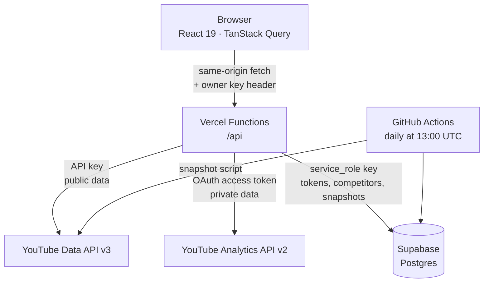

# JuxtaTube

[](https://github.com/1gabeortiz/JuxtaTube/actions/workflows/ci.yml)

An analytics dashboard for YouTube creators. It pulls public channel stats, private
performance data, tag research, and competitor growth into one place — and it does
so under a hard API quota of 10,000 units per day, which shaped most of the
interesting decisions in the codebase.

**Live:** [juxtatube.vercel.app](https://juxtatube.vercel.app)

---

## What it does

Four pages, each answering a different question.

| Page | Question it answers | Data source |
| --- | --- | --- |
| **Overview** | How is the channel doing right now? | YouTube Data API v3 (public) |
| **Analytics** | Who is watching, for how long, and where did they come from? | YouTube Analytics API v2 (private, OAuth) |
| **Tags** | What tags should this video use, and what are others in the niche using? | Data API v3 |
| **Competitors** | Are the channels I care about growing faster than me? | Data API v3 + recorded daily snapshots |

---

## Architecture

The browser never talks to Google or to the database. Every external call goes
through a serverless function, because the API key, the OAuth refresh token, and
the database service-role key are all secrets that cannot ship to a browser.



### Why a database at all

Two reasons, both forced by the APIs rather than chosen.

The OAuth **refresh token** has to persist somewhere the browser cannot reach, so
the owner authorizes once instead of on every visit.

**Competitor history does not exist.** The Data API returns a channel's subscriber
count *right now* and offers no way to ask what it was last month. The only way to
draw a growth chart is to record a snapshot every day and accumulate your own
history, which is what the scheduled job does.

---

## Engineering decisions worth reading

These are the parts I would want a reviewer to look at.

**Quota drove the API design.** The obvious way to list a channel's recent videos
is `search.list`, which costs 100 of the 10,000 daily units. Going
`channels.list → playlistItems.list → videos.list` returns the same result for 3
units — 33x cheaper — and gives reliable newest-first ordering, which `search.list`
does not guarantee. Every route documents its own quota cost, and the Tags page
shows the user the cost of a search before they run it.

**Private responses must not reach a shared cache.** Cached responses cost zero
quota, so most routes set `s-maxage` and let Vercel's CDN serve repeats. But the
owner check reads a request *header* while the CDN keys its cache on the *URL
alone*. One authorized request would have populated the cache and handed the next
anonymous visitor private analytics without the function ever running. Gated routes
therefore use `Cache-Control: private`, which permits browser caching and forbids
shared caching. This was a real bug found while building the access gate, not a
hypothetical.

**The access gate fails closed.** The owner key is compared with
`timingSafeEqual`, because `===` returns as soon as two characters differ and leaks
how much of the key was correct. If `OWNER_ACCESS_KEY` is unset, the guard throws
rather than treating "no key configured" as "no key needed" — a deploy that forgot
the variable locks down instead of quietly exposing everything.

**A guard for a failure the build cannot catch.** Vercel compiles every file under
`api/` into its own serverless function and caps a Hobby deployment at 12. The
limit is enforced when the deployment uploads, *after* the build succeeds, so
typecheck, tests, and `vite build` all stay green and the only symptom is
"Deployment has failed" with an empty log. `npm run check:functions` replicates
Vercel's counting rule and fails CI before a merge can break deploys.

**Two TypeScript configs, on purpose.** The frontend uses `bundler` module
resolution, where Vite rewrites import specifiers and extensionless imports are
fine. Vercel hands each API file straight to Node as ESM, which rewrites nothing
and requires explicit `.js` extensions on relative imports. `tsconfig.api.json`
applies `nodenext` resolution to `api/` only, turning what was a production
`ERR_MODULE_NOT_FOUND` crash into a local compile error.

**Route-level code splitting.** Recharts is larger than the rest of the app
combined. The two charting pages are lazy-loaded, so the Overview page ships 90 kB
gzipped instead of 190 kB, and Vite factors the shared library into one chunk that
both pages reuse.

---

## Tech stack

| Layer | Choice |
| --- | --- |
| UI | React 19, TypeScript 6, Tailwind CSS 4 |
| Build | Vite 8 |
| Data fetching | TanStack Query 5 |
| Routing | React Router 8 |
| Charts | Recharts |
| Backend | Vercel Functions (Node 22, Web `Request`/`Response`) |
| Database | Supabase Postgres, accessed over PostgREST |
| Scheduled job | GitHub Actions |
| Tests | Vitest, React Testing Library |

---

## Running locally

Requires **Node 22+** and a Google Cloud project with the YouTube Data API v3 and
YouTube Analytics API v2 enabled.

```bash
git clone https://github.com/1gabeortiz/JuxtaTube.git
cd JuxtaTube
npm install
cp .env.example .env.local   # then fill in the values below
```

The frontend alone runs with `npm run dev`, but the `/api` routes only exist under
the Vercel CLI:

```bash
npm i -g vercel
vercel dev
```

### Environment variables

Only `VITE_`-prefixed variables reach the browser. Everything else is read via
`process.env` inside `/api` and never bundled into client code.

| Variable | Secret | Purpose |
| --- | --- | --- |
| `VITE_GOOGLE_CLIENT_ID` | No | OAuth client ID; protected by the registered origin list |
| `YT_DATA_API_KEY` | Yes | Data API key for public channel and video data |
| `YT_CHANNEL_ID` | No | Public channel identifier, starts with `UC` |
| `GOOGLE_CLIENT_SECRET` | Yes | Exchanges the OAuth code for tokens |
| `OAUTH_REDIRECT_URI` | No | Must match the Google Cloud credential exactly |
| `SUPABASE_URL` | No | Project REST endpoint |
| `SUPABASE_SERVICE_ROLE_KEY` | Yes | Bypasses row-level security; server only |
| `OWNER_ACCESS_KEY` | Yes | Unlocks private analytics and owner-only writes |

`supabase/schema.sql` contains the table definitions. Row-level security is enabled
on every table with **no policies attached**, which makes them unreadable to the
anon key entirely — only `service_role` reaches them, and only from the server.

---

## Scripts

```bash
npm run dev              # Vite dev server (frontend only)
npm run build            # production build
npm test                 # run the test suite once
npm run test:watch       # re-run on change
npm run test:coverage    # coverage report
npm run lint             # ESLint
npm run typecheck        # both tsconfigs
npm run check:functions  # verify the Vercel function count
```

### What the tests cover

Coverage sits around 20% overall, and that number is deliberate rather than
aspirational. The utility modules are near 100% and the API client is at 100%,
while pages and chart components are untested. The logic worth testing is the code
with edge cases — character budgets, UTC date handling, duration parsing,
malformed query strings, and the access guard — not whether Recharts draws a
rectangle. No coverage threshold is configured, since a number chosen to make the
current state pass is decoration.

The suite runs under `TZ=America/Denver`. Several formatters exist specifically to
stop YouTube's UTC timestamps from sliding a day backward when rendered in a
western timezone; under the default UTC those regression tests would pass without
proving anything.

---

## Access model

The deployment is public, so routes are gated by what they expose or cost rather
than uniformly behind a login.

| Open to everyone | Requires the owner key |
| --- | --- |
| Channel overview, recent videos | Private analytics (all three routes) |
| Competitor stats and growth history | Official tag suggestions |
| Tag explorer by channel (3 quota units) | Tag explorer by keyword (101 units) |
| Connection status, read-only | Connect/disconnect, add/remove competitors |

The reasoning differs per route. Analytics is genuinely private. The write routes
matter because a stranger completing the OAuth flow would overwrite the single
stored token row and repoint the app at their own channel. Keyword search is gated
purely on cost: at 101 units, an open endpoint lets anyone drain the daily quota in
a few minutes and take the public pages down with it.

---

## Limitations

**Single-channel by design.** One channel ID, one stored token, one owner key.
Supporting arbitrary creators would need per-user accounts and row-level security
policies, but the real blocker is external: `yt-analytics.readonly` is a sensitive
scope, so an unverified app can only authorize manually-added test users, capped at
100. Serving strangers requires Google's verification review.

**Quota is per project, not per user.** All 10,000 daily units are shared. This
would be the binding constraint on any multi-user version well before the code was.

**Competitor history starts when tracking starts.** There is no backfill, because
YouTube publishes no historical data for channels you do not own.

---

## License

MIT
