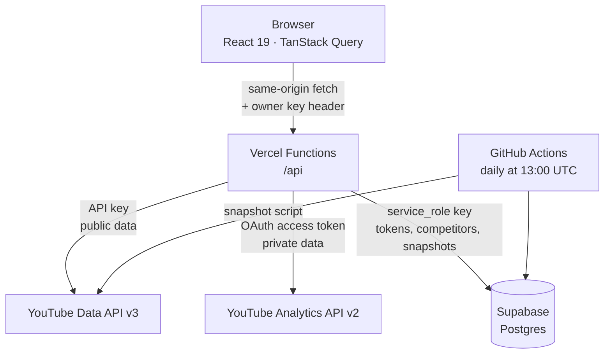

# How JuxtaTube works

Notes for developers reading the code. If you just want to run the dashboard, the
[README](../README.md) is the place to start.

---

## Shape of the system

The browser never talks to Google or to the database directly. Every external call
goes through a serverless function, because the API key, the OAuth refresh token,
and the database service-role key are all secrets that cannot ship to a browser.



### Why there is a database

Both reasons are forced by the APIs rather than chosen.

The OAuth **refresh token** has to persist somewhere the browser cannot reach, so
the owner authorizes once instead of on every visit.

**Competitor history does not exist.** The Data API returns a channel's subscriber
count *right now* and offers no way to ask what it was last month. The only way to
draw a growth chart is to record a snapshot every day and accumulate your own
history, which is what the scheduled job does.

---

## Tech stack

| Layer | Choice |
| --- | --- |
| UI | React 19, TypeScript 6, Tailwind CSS 4 |
| Build | Vite 8 |
| Data fetching | TanStack Query 5 |
| Routing | React Router 8 |
| Charts | Recharts |
| Backend | Vercel Functions (Node 22, Web `Request`/`Response`) |
| Database | Supabase Postgres, accessed over PostgREST |
| Scheduled job | GitHub Actions |
| Tests | Vitest, React Testing Library |

---

## Decisions worth reading

**Quota drove the API design.** The obvious way to list a channel's recent videos
is `search.list`, which costs 100 of the 10,000 daily units. Going
`channels.list → playlistItems.list → videos.list` returns the same result for 3
units — 33x cheaper — and gives reliable newest-first ordering, which `search.list`
does not guarantee. Every route documents its own quota cost, and the Tags page
shows the user what a search will cost before they run it.

**Private responses must not reach a shared cache.** Cached responses cost zero
quota, so most routes set `s-maxage` and let Vercel's CDN serve repeats. But the
owner check reads a request *header* while the CDN keys its cache on the *URL
alone*. One authorized request would have populated the cache and handed the next
anonymous visitor private analytics without the function ever running. Gated routes
therefore use `Cache-Control: private`, which permits browser caching and forbids
shared caching. This was a real bug found while building the access gate, not a
hypothetical one.

**The access gate fails closed.** The owner key is compared with
`timingSafeEqual`, because `===` returns as soon as two characters differ and leaks
how much of the key was correct. If `OWNER_ACCESS_KEY` is unset, the guard throws
rather than treating "no key configured" as "no key needed" — a deploy that forgot
the variable locks down instead of quietly exposing everything.

**A guard for a failure the build cannot catch.** Vercel compiles every file under
`api/` into its own serverless function and caps a Hobby deployment at 12. The
limit is enforced when the deployment uploads, *after* the build succeeds, so
typecheck, tests, and `vite build` all stay green and the only symptom is
"Deployment has failed" with an empty log. `npm run check:functions` replicates
Vercel's counting rule and fails CI before a merge can break deploys.

**Two TypeScript configs, on purpose.** The frontend uses `bundler` module
resolution, where Vite rewrites import specifiers and extensionless imports are
fine. Vercel hands each API file straight to Node as ESM, which rewrites nothing
and requires explicit `.js` extensions on relative imports. `tsconfig.api.json`
applies `nodenext` resolution to `api/` only, turning what was a production
`ERR_MODULE_NOT_FOUND` crash into a local compile error.

**Route-level code splitting.** Recharts is larger than the rest of the app
combined. The two charting pages are lazy-loaded, so the Overview page ships about
90 kB gzipped instead of 190 kB, and Vite factors the shared library into one chunk
that both pages reuse.

**The popup OAuth flow needs a literal `"postmessage"`.** Google Identity Services
in popup mode hands the authorization code to a JavaScript callback instead of
redirecting. For the server-side exchange, Google expects the string
`"postmessage"` as `redirect_uri`. Passing a real URL fails with
`redirect_uri_mismatch` even when that URL is correctly registered. This is
load-bearing and effectively undocumented, and it is why the setup guide asks for
an authorized **JavaScript origin** rather than a redirect URI.

---

## Access model

The deployment is public, so routes are gated by what they expose or cost rather
than uniformly behind a login.

| Open to everyone | Requires the owner key |
| --- | --- |
| Channel overview, recent videos | Private analytics (all three routes) |
| Competitor stats and growth history | Official tag suggestions |
| Tag explorer by channel (3 quota units) | Tag explorer by keyword (101 units) |
| Connection status, read-only | Connect/disconnect, add/remove competitors |

The reasoning differs per route. Analytics is genuinely private. The write routes
matter because a stranger completing the OAuth flow would overwrite the single
stored token row and repoint the app at their own channel. Keyword search is gated
purely on cost: at 101 units, an open endpoint lets anyone drain the daily quota in
a few minutes and take the public pages down with it.

Row-level security is enabled on every database table with **no policies
attached**, which makes them unreadable to the anon key entirely. Only
`service_role` reaches them, and only from the server.

---

## What the tests cover

Coverage sits around 20% overall, and that number is deliberate rather than
aspirational. The utility modules are near 100% and the API client is at 100%,
while pages and chart components are untested. The logic worth testing is the code
with edge cases — character budgets, UTC date handling, duration parsing,
malformed query strings, and the access guard — not whether Recharts draws a
rectangle. No coverage threshold is configured, since a number chosen to make the
current state pass is decoration.

The suite runs under `TZ=America/Denver`. Several formatters exist specifically to
stop YouTube's UTC timestamps from sliding a day backward when rendered in a
western timezone; under the default UTC those regression tests would pass without
proving anything.

```bash
npm test                 # run once
npm run test:watch       # re-run on change
npm run test:coverage    # coverage report
npm run lint             # ESLint
npm run typecheck        # both tsconfigs
npm run check:functions  # verify the Vercel function count
```
